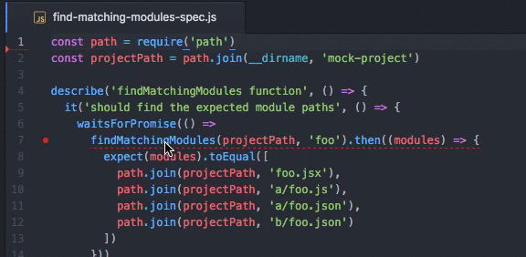
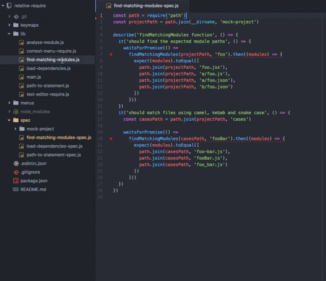

### Relative Require

Injects module require statements with the correct relative require path

## Usage

### From the Editor

Highlight the module you want to import and hit `ctrl-alt-r` to inject the require statement

### From the Tree View

Right click a module file from the tree view and select 'Relative Require'

## Features

* Require project modules with correct relative path
* Require from your projects `package.json` dependencies
* Infers the import statement syntax from the active files contents i.e. `require` or `import`
* Right click a file in the tree view to import
